# 农产品小程序业务流程图

## 文档范围

本文是《农产品小程序前后端打通计划》的流程图版本，覆盖首期常温、干制农产品商城的完整交易闭环。接口、表结构和状态以以下文档为准：

1. [商城运营后台落地计划](./2026-07-24-商城运营后台落地计划.md)
2. [农产品小程序前后端打通计划](./2026-07-27-农产品小程序前后端打通计划.md)

首期不包含鲜果冷链、称重计价、预售、团购、分销、退款和在线售后。购物车保存在小程序本地，不增加购物车表。

## 1. 系统总览

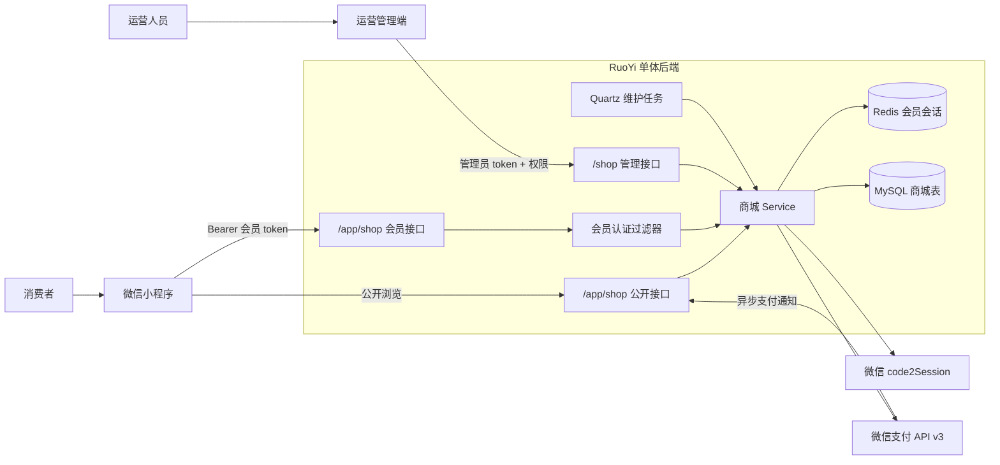
```mermaid
flowchart LR
    Customer[消费者] --> MiniApp[微信小程序]
    Operator[运营人员] --> Admin[运营管理端]

    MiniApp -->|公开浏览| PublicApi["/app/shop 公开接口"]
    MiniApp -->|Bearer 会员 token| MemberApi["/app/shop 会员接口"]
    Admin -->|管理员 token + 权限| AdminApi["/shop 管理接口"]

    subgraph Backend[RuoYi 单体后端]
        PublicApi --> ShopService[商城 Service]
        MemberApi --> MemberAuth[会员认证过滤器]
        MemberAuth --> ShopService
        AdminApi --> ShopService
        ShopService --> Redis[(Redis 会员会话)]
        ShopService --> MySQL[(MySQL 商城表)]
        Quartz[Quartz 维护任务] --> ShopService
    end

    ShopService --> WxLogin[微信 code2Session]
    ShopService --> WxPay[微信支付 API v3]
    WxPay -->|异步支付通知| PublicApi
```

核心边界：

- 管理员使用 `sys_user`，消费者使用 `mall_member`，两种 token 不能互换。
- Controller 只收发 DTO，价格、库存、优惠和状态判断都在 Service。
- MySQL 保存交易事实，Redis 只保存可失效的会员会话，不用 Redis 代替订单幂等约束。

## 2. 商品上架流程

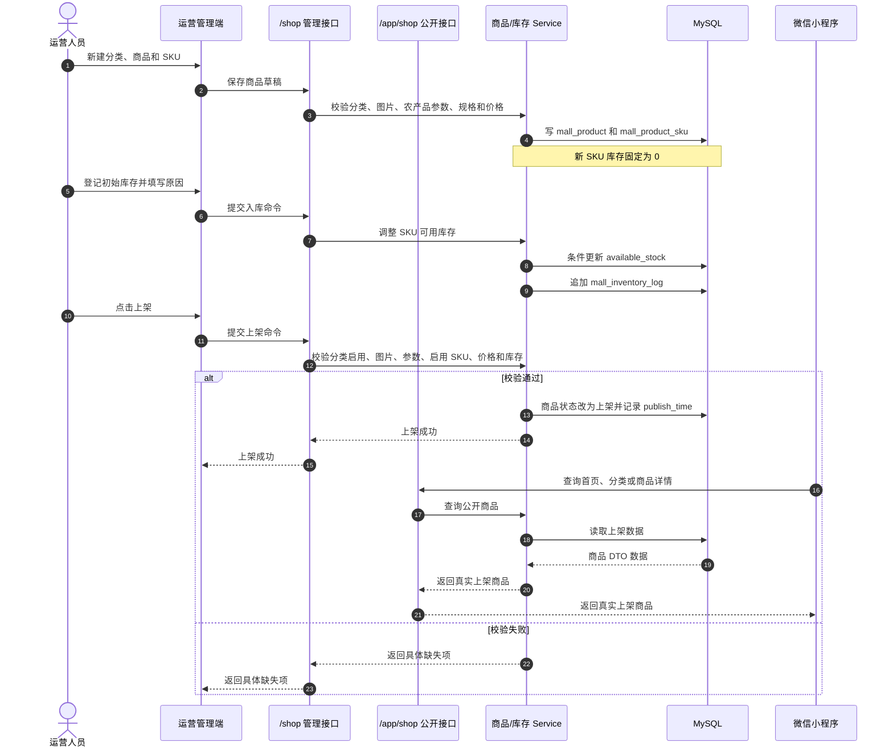
```mermaid
sequenceDiagram
    autonumber
    actor Operator as 运营人员
    participant Admin as 运营管理端
    participant API as /shop 管理接口
    participant PublicAPI as /app/shop 公开接口
    participant Service as 商品/库存 Service
    participant DB as MySQL
    participant App as 微信小程序

    Operator->>Admin: 新建分类、商品和 SKU
    Admin->>API: 保存商品草稿
    API->>Service: 校验分类、图片、农产品参数、规格和价格
    Service->>DB: 写 mall_product 和 mall_product_sku
    Note over Service,DB: 新 SKU 库存固定为 0

    Operator->>Admin: 登记初始库存并填写原因
    Admin->>API: 提交入库命令
    API->>Service: 调整 SKU 可用库存
    Service->>DB: 条件更新 available_stock
    Service->>DB: 追加 mall_inventory_log

    Operator->>Admin: 点击上架
    Admin->>API: 提交上架命令
    API->>Service: 校验分类启用、图片、参数、启用 SKU、价格和库存
    alt 校验通过
        Service->>DB: 商品状态改为上架并记录 publish_time
        Service-->>API: 上架成功
        API-->>Admin: 上架成功
        App->>PublicAPI: 查询首页、分类或商品详情
        PublicAPI->>Service: 查询公开商品
        Service->>DB: 读取上架数据
        DB-->>Service: 商品 DTO 数据
        Service-->>PublicAPI: 返回真实上架商品
        PublicAPI-->>App: 返回真实上架商品
    else 校验失败
        Service-->>API: 返回具体缺失项
        API-->>Admin: 返回具体缺失项
    end
```

不可省的规则：

- 初始库存也必须走库存命令并产生流水，禁止直接编辑库存数字。
- 图片、产地、净含量、加工方式、配料、储存条件和保质期由后台维护。
- 下架只影响新浏览和新下单，不能修改历史订单快照。

## 3. 游客浏览与搜索流程

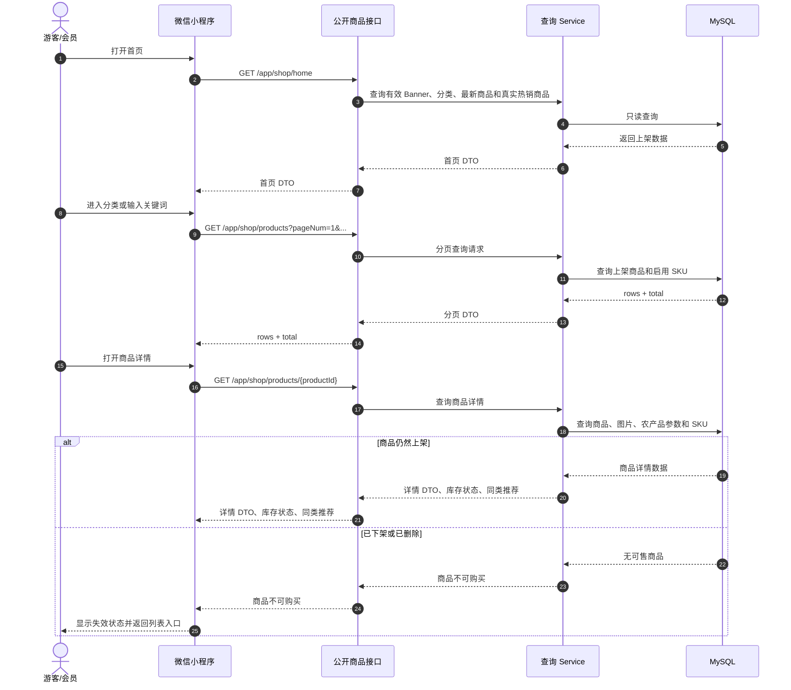
```mermaid
sequenceDiagram
    autonumber
    actor User as 游客/会员
    participant App as 微信小程序
    participant API as 公开商品接口
    participant Service as 查询 Service
    participant DB as MySQL

    User->>App: 打开首页
    App->>API: GET /app/shop/home
    API->>Service: 查询有效 Banner、分类、最新商品和真实热销商品
    Service->>DB: 只读查询
    DB-->>Service: 返回上架数据
    Service-->>API: 首页 DTO
    API-->>App: 首页 DTO

    User->>App: 进入分类或输入关键词
    App->>API: GET /app/shop/products?pageNum=1&...
    API->>Service: 分页查询请求
    Service->>DB: 查询上架商品和启用 SKU
    DB-->>Service: rows + total
    Service-->>API: 分页 DTO
    API-->>App: rows + total

    User->>App: 打开商品详情
    App->>API: GET /app/shop/products/{productId}
    API->>Service: 查询商品详情
    Service->>DB: 查询商品、图片、农产品参数和 SKU
    alt 商品仍然上架
        DB-->>Service: 商品详情数据
        Service-->>API: 详情 DTO、库存状态、同类推荐
        API-->>App: 详情 DTO、库存状态、同类推荐
    else 已下架或已删除
        DB-->>Service: 无可售商品
        Service-->>API: 商品不可购买
        API-->>App: 商品不可购买
        App-->>User: 显示失效状态并返回列表入口
    end
```

前端交互：

- 搜索历史只保存在本地；关键词停顿约 300ms 或用户确认后才请求。
- 分类切换或页面卸载后忽略旧响应，避免慢请求覆盖新结果。
- 商品库存为零仍可展示，但必须明确标记售罄并禁用购买按钮。

## 4. 按需登录流程

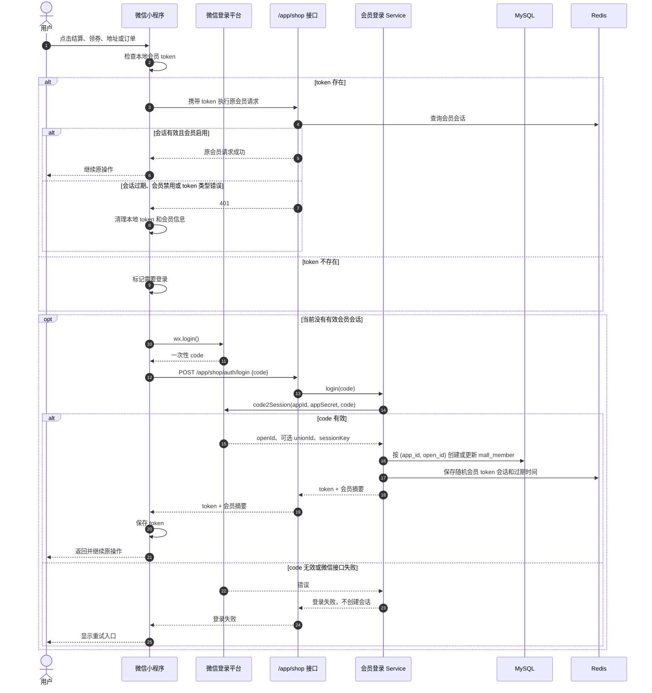
```mermaid
sequenceDiagram
    autonumber
    actor User as 用户
    participant App as 微信小程序
    participant WX as 微信登录平台
    participant API as /app/shop 接口
    participant Service as 会员登录 Service
    participant DB as MySQL
    participant Redis as Redis

    User->>App: 点击结算、领券、地址或订单
    App->>App: 检查本地会员 token
    alt token 存在
        App->>API: 携带 token 执行原会员请求
        API->>Redis: 查询会员会话
        alt 会话有效且会员启用
            API-->>App: 原会员请求成功
            App-->>User: 继续原操作
        else 会话过期、会员禁用或 token 类型错误
            API-->>App: 401
            App->>App: 清理本地 token 和会员信息
        end
    else token 不存在
        App->>App: 标记需要登录
    end

    opt 当前没有有效会员会话
        App->>WX: wx.login()
        WX-->>App: 一次性 code
        App->>API: POST /app/shop/auth/login {code}
        API->>Service: login(code)
        Service->>WX: code2Session(appId, appSecret, code)
        alt code 有效
            WX-->>Service: openId、可选 unionId、sessionKey
            Service->>DB: 按 (app_id, open_id) 创建或更新 mall_member
            Service->>Redis: 保存随机会员 token 会话和过期时间
            Service-->>API: token + 会员摘要
            API-->>App: token + 会员摘要
            App->>App: 保存 token
            App-->>User: 返回并继续原操作
        else code 无效或微信接口失败
            WX-->>Service: 错误
            Service-->>API: 登录失败，不创建会话
            API-->>App: 登录失败
            App-->>User: 显示重试入口
        end
    end
```

安全约束：

- 小程序只上传一次性 code，不能上传并让后端信任客户端给出的 OpenID。
- `AppSecret`、session key、完整 token 不写入日志，也不能进入小程序包。
- 普通 POST 遇到 401 后不自动重放；订单创建使用相同 `clientRequestNo` 由用户主动重试。

## 5. 会员接口鉴权流程

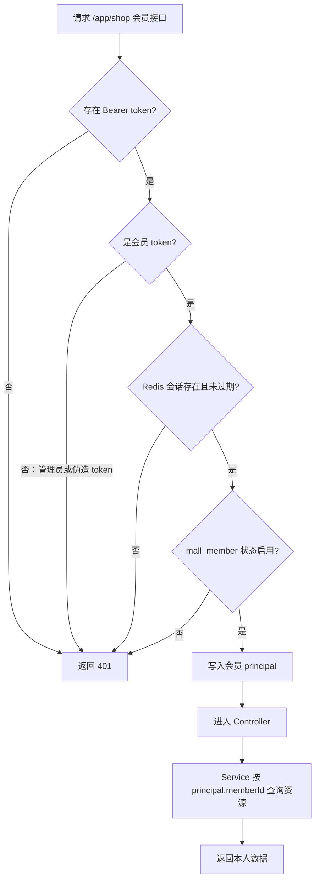
```mermaid
flowchart TD
    Request[请求 /app/shop 会员接口] --> Header{存在 Bearer token?}
    Header -- 否 --> Unauthorized[返回 401]
    Header -- 是 --> TokenType{是会员 token?}
    TokenType -- "否：管理员或伪造 token" --> Unauthorized
    TokenType -- 是 --> RedisSession{Redis 会话存在且未过期?}
    RedisSession -- 否 --> Unauthorized
    RedisSession -- 是 --> MemberStatus{mall_member 状态启用?}
    MemberStatus -- 否 --> Unauthorized
    MemberStatus -- 是 --> Principal[写入会员 principal]
    Principal --> Controller[进入 Controller]
    Controller --> Ownership[Service 按 principal.memberId 查询资源]
    Ownership --> Result[返回本人数据]
```

所有地址、优惠券和订单接口从会员 principal 获取 `memberId`，请求参数不允许携带或覆盖会员 ID。

## 6. 本地购物车流程

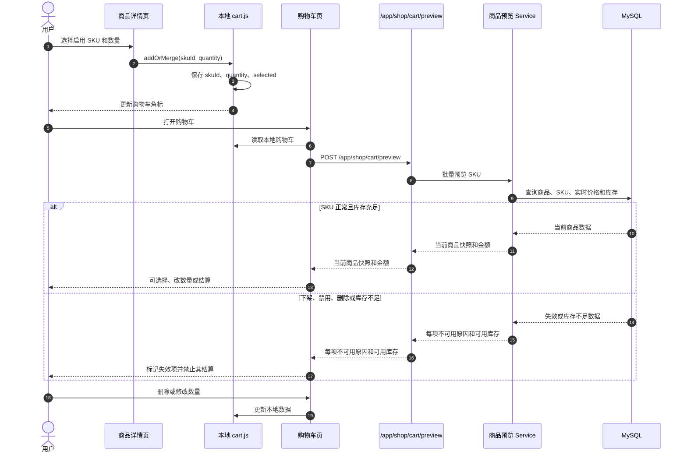
```mermaid
sequenceDiagram
    autonumber
    actor User as 用户
    participant Detail as 商品详情页
    participant CartStore as 本地 cart.js
    participant CartPage as 购物车页
    participant API as /app/shop/cart/preview
    participant Service as 商品预览 Service
    participant DB as MySQL

    User->>Detail: 选择启用 SKU 和数量
    Detail->>CartStore: addOrMerge(skuId, quantity)
    CartStore->>CartStore: 保存 skuId、quantity、selected
    CartStore-->>User: 更新购物车角标

    User->>CartPage: 打开购物车
    CartPage->>CartStore: 读取本地购物车
    CartPage->>API: POST /app/shop/cart/preview
    API->>Service: 批量预览 SKU
    Service->>DB: 查询商品、SKU、实时价格和库存
    alt SKU 正常且库存充足
        DB-->>Service: 当前商品数据
        Service-->>API: 当前商品快照和金额
        API-->>CartPage: 当前商品快照和金额
        CartPage-->>User: 可选择、改数量或结算
    else 下架、禁用、删除或库存不足
        DB-->>Service: 失效或库存不足数据
        Service-->>API: 每项不可用原因和可用库存
        API-->>CartPage: 每项不可用原因和可用库存
        CartPage-->>User: 标记失效项并禁止其结算
    end

    User->>CartPage: 删除或修改数量
    CartPage->>CartStore: 更新本地数据
```

购物车不登录也能使用；价格、库存和商品状态不得以本地数据为准。

## 7. 地址管理流程

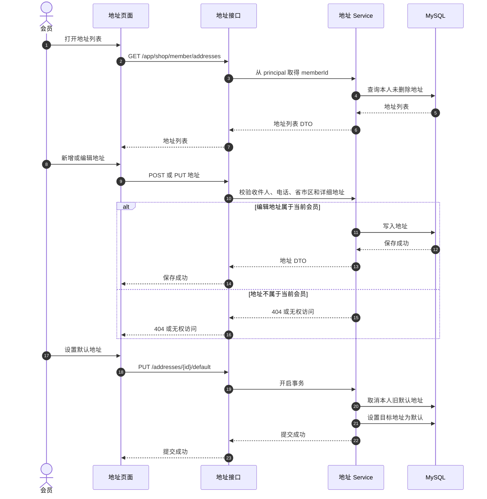
```mermaid
sequenceDiagram
    autonumber
    actor User as 会员
    participant App as 地址页面
    participant API as 地址接口
    participant Service as 地址 Service
    participant DB as MySQL

    User->>App: 打开地址列表
    App->>API: GET /app/shop/member/addresses
    API->>Service: 从 principal 取得 memberId
    Service->>DB: 查询本人未删除地址
    DB-->>Service: 地址列表
    Service-->>API: 地址列表 DTO
    API-->>App: 地址列表

    User->>App: 新增或编辑地址
    App->>API: POST 或 PUT 地址
    API->>Service: 校验收件人、电话、省市区和详细地址
    alt 编辑地址属于当前会员
        Service->>DB: 写入地址
        DB-->>Service: 保存成功
        Service-->>API: 地址 DTO
        API-->>App: 保存成功
    else 地址不属于当前会员
        Service-->>API: 404 或无权访问
        API-->>App: 404 或无权访问
    end

    User->>App: 设置默认地址
    App->>API: PUT /addresses/{id}/default
    API->>Service: 开启事务
    Service->>DB: 取消本人旧默认地址
    Service->>DB: 设置目标地址为默认
    Service-->>API: 提交成功
    API-->>App: 提交成功
```

删除地址使用逻辑删除；历史订单始终显示下单时保存的地址快照。

## 8. 优惠券领取流程

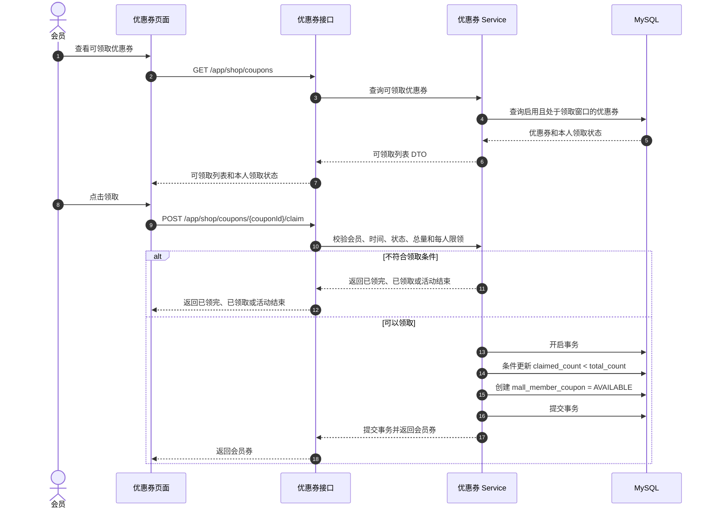
```mermaid
sequenceDiagram
    autonumber
    actor User as 会员
    participant App as 优惠券页面
    participant API as 优惠券接口
    participant Service as 优惠券 Service
    participant DB as MySQL

    User->>App: 查看可领取优惠券
    App->>API: GET /app/shop/coupons
    API->>Service: 查询可领取优惠券
    Service->>DB: 查询启用且处于领取窗口的优惠券
    DB-->>Service: 优惠券和本人领取状态
    Service-->>API: 可领取列表 DTO
    API-->>App: 可领取列表和本人领取状态

    User->>App: 点击领取
    App->>API: POST /app/shop/coupons/{couponId}/claim
    API->>Service: 校验会员、时间、状态、总量和每人限领
    alt 不符合领取条件
        Service-->>API: 返回已领完、已领取或活动结束
        API-->>App: 返回已领完、已领取或活动结束
    else 可以领取
        Service->>DB: 开启事务
        Service->>DB: 条件更新 claimed_count < total_count
        Service->>DB: 创建 mall_member_coupon = AVAILABLE
        Service->>DB: 提交事务
        Service-->>API: 提交事务并返回会员券
        API-->>App: 返回会员券
    end
```

领券按钮在请求中必须禁用；`@RepeatSubmit` 只拦截短时间重复点击，最终数量限制由数据库条件更新和事务保证。

## 9. 订单预结算流程

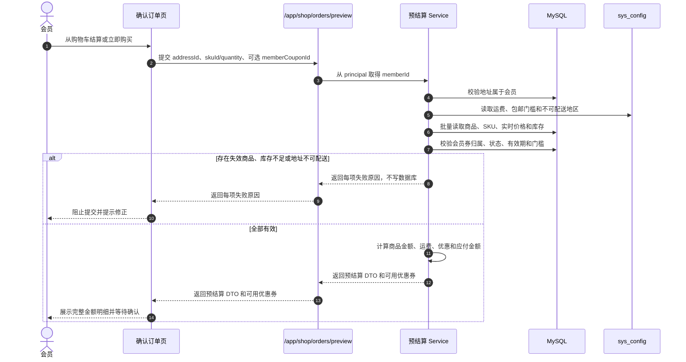
```mermaid
sequenceDiagram
    autonumber
    actor User as 会员
    participant App as 确认订单页
    participant API as /app/shop/orders/preview
    participant Service as 预结算 Service
    participant DB as MySQL
    participant Config as sys_config

    User->>App: 从购物车结算或立即购买
    App->>API: 提交 addressId、skuId/quantity、可选 memberCouponId
    API->>Service: 从 principal 取得 memberId
    Service->>DB: 校验地址属于会员
    Service->>Config: 读取运费、包邮门槛和不可配送地区
    Service->>DB: 批量读取商品、SKU、实时价格和库存
    Service->>DB: 校验会员券归属、状态、有效期和门槛

    alt 存在失效商品、库存不足或地址不可配送
        Service-->>API: 返回每项失败原因，不写数据库
        API-->>App: 返回每项失败原因
        App-->>User: 阻止提交并提示修正
    else 全部有效
        Service->>Service: 计算商品金额、运费、优惠和应付金额
        Service-->>API: 返回预结算 DTO 和可用优惠券
        API-->>App: 返回预结算 DTO 和可用优惠券
        App-->>User: 展示完整金额明细并等待确认
    end
```

预结算只用于展示，不锁库存、不锁券、不创建订单。正式下单必须重新校验并重新计算。

## 10. 幂等创建订单流程

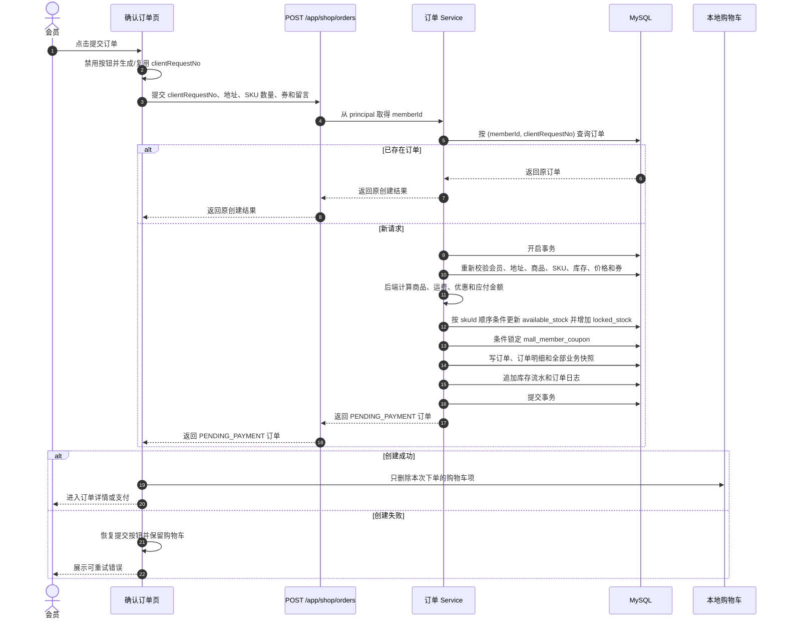
```mermaid
sequenceDiagram
    autonumber
    actor User as 会员
    participant App as 确认订单页
    participant API as POST /app/shop/orders
    participant Service as 订单 Service
    participant DB as MySQL
    participant Cart as 本地购物车

    User->>App: 点击提交订单
    App->>App: 禁用按钮并生成/复用 clientRequestNo
    App->>API: 提交 clientRequestNo、地址、SKU 数量、券和留言
    API->>Service: 从 principal 取得 memberId
    Service->>DB: 按 (memberId, clientRequestNo) 查询订单

    alt 已存在订单
        DB-->>Service: 返回原订单
        Service-->>API: 返回原创建结果
        API-->>App: 返回原创建结果
    else 新请求
        Service->>DB: 开启事务
        Service->>DB: 重新校验会员、地址、商品、SKU、库存、价格和券
        Service->>Service: 后端计算商品、运费、优惠和应付金额
        Service->>DB: 按 skuId 顺序条件更新 available_stock 并增加 locked_stock
        Service->>DB: 条件锁定 mall_member_coupon
        Service->>DB: 写订单、订单明细和全部业务快照
        Service->>DB: 追加库存流水和订单日志
        Service->>DB: 提交事务
        Service-->>API: 返回 PENDING_PAYMENT 订单
        API-->>App: 返回 PENDING_PAYMENT 订单
    end

    alt 创建成功
        App->>Cart: 只删除本次下单的购物车项
        App-->>User: 进入订单详情或支付
    else 创建失败
        App->>App: 恢复提交按钮并保留购物车
        App-->>User: 展示可重试错误
    end
```

并发请求都未查到旧订单时，唯一索引 `(member_id, client_request_no)` 是最终防线；冲突请求读取并返回先创建的订单，不能再次锁库存。

零元订单在同一事务内直接完成支付状态迁移、库存实扣和优惠券核销，不调用微信支付。

## 11. 发起微信支付流程

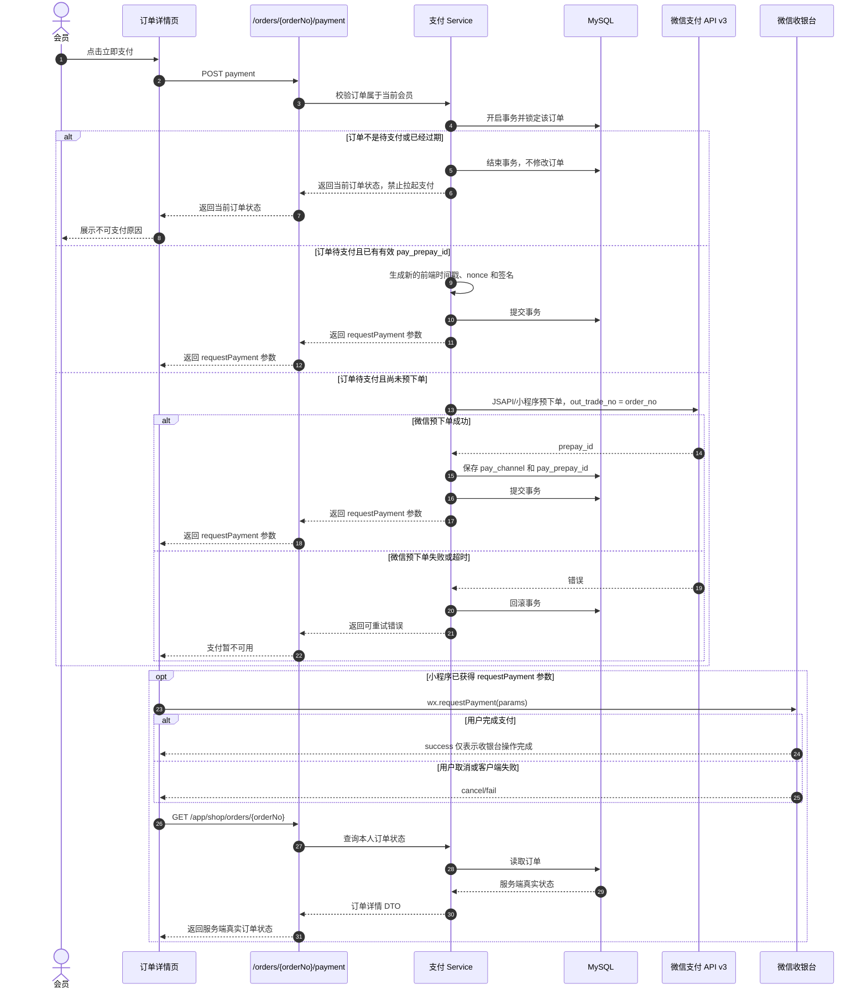
```mermaid
sequenceDiagram
    autonumber
    actor User as 会员
    participant App as 订单详情页
    participant API as /orders/{orderNo}/payment
    participant Service as 支付 Service
    participant DB as MySQL
    participant Pay as 微信支付 API v3
    participant Cashier as 微信收银台

    User->>App: 点击立即支付
    App->>API: POST payment
    API->>Service: 校验订单属于当前会员
    Service->>DB: 开启事务并锁定该订单

    alt 订单不是待支付或已经过期
        Service->>DB: 结束事务，不修改订单
        Service-->>API: 返回当前订单状态，禁止拉起支付
        API-->>App: 返回当前订单状态
        App-->>User: 展示不可支付原因
    else 订单待支付且已有有效 pay_prepay_id
        Service->>Service: 生成新的前端时间戳、nonce 和签名
        Service->>DB: 提交事务
        Service-->>API: 返回 requestPayment 参数
        API-->>App: 返回 requestPayment 参数
    else 订单待支付且尚未预下单
        Service->>Pay: JSAPI/小程序预下单，out_trade_no = order_no
        alt 微信预下单成功
            Pay-->>Service: prepay_id
            Service->>DB: 保存 pay_channel 和 pay_prepay_id
            Service->>DB: 提交事务
            Service-->>API: 返回 requestPayment 参数
            API-->>App: 返回 requestPayment 参数
        else 微信预下单失败或超时
            Pay-->>Service: 错误
            Service->>DB: 回滚事务
            Service-->>API: 返回可重试错误
            API-->>App: 支付暂不可用
        end
    end

    opt 小程序已获得 requestPayment 参数
        App->>Cashier: wx.requestPayment(params)
        alt 用户完成支付
            Cashier-->>App: success 仅表示收银台操作完成
        else 用户取消或客户端失败
            Cashier-->>App: cancel/fail
        end
        App->>API: GET /app/shop/orders/{orderNo}
        API->>Service: 查询本人订单状态
        Service->>DB: 读取订单
        DB-->>Service: 服务端真实状态
        Service-->>API: 订单详情 DTO
        API-->>App: 返回服务端真实订单状态
    end
```

客户端 `success` 不能更新订单，也不能单独作为“支付成功”依据。只有服务端订单进入 `PENDING_SHIPMENT` 才展示支付成功。

首期为避免增加支付尝试表，首次预下单只对当前订单持有短时行锁，并设置严格的微信接口超时；事务内不自动重试外部请求。未来出现多支付渠道或高并发支付后，再拆支付尝试记录。

## 12. 微信支付回调流程

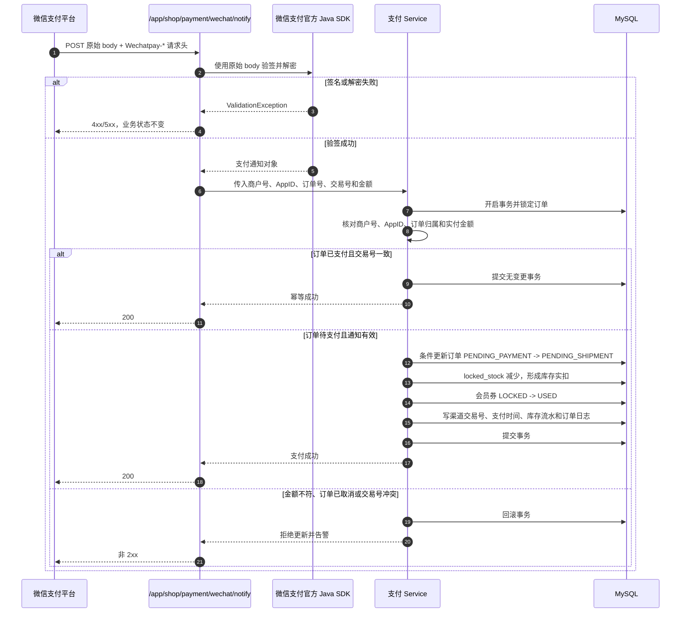
```mermaid
sequenceDiagram
    autonumber
    participant Pay as 微信支付平台
    participant Notify as /app/shop/payment/wechat/notify
    participant SDK as 微信支付官方 Java SDK
    participant Service as 支付 Service
    participant DB as MySQL

    Pay->>Notify: POST 原始 body + Wechatpay-* 请求头
    Notify->>SDK: 使用原始 body 验签并解密
    alt 签名或解密失败
        SDK-->>Notify: ValidationException
        Notify-->>Pay: 4xx/5xx，业务状态不变
    else 验签成功
        SDK-->>Notify: 支付通知对象
        Notify->>Service: 传入商户号、AppID、订单号、交易号和金额
        Service->>DB: 开启事务并锁定订单
        Service->>Service: 核对商户号、AppID、订单归属和实付金额
        alt 订单已支付且交易号一致
            Service->>DB: 提交无变更事务
            Service-->>Notify: 幂等成功
            Notify-->>Pay: 200
        else 订单待支付且通知有效
            Service->>DB: 条件更新订单 PENDING_PAYMENT -> PENDING_SHIPMENT
            Service->>DB: locked_stock 减少，形成库存实扣
            Service->>DB: 会员券 LOCKED -> USED
            Service->>DB: 写渠道交易号、支付时间、库存流水和订单日志
            Service->>DB: 提交事务
            Service-->>Notify: 支付成功
            Notify-->>Pay: 200
        else 金额不符、订单已取消或交易号冲突
            Service->>DB: 回滚事务
            Service-->>Notify: 拒绝更新并告警
            Notify-->>Pay: 非 2xx
        end
    end
```

支付回调可能重复、延迟或乱序，必须使用订单旧状态、渠道交易号唯一约束和事务保证幂等。

## 13. 主动取消订单流程

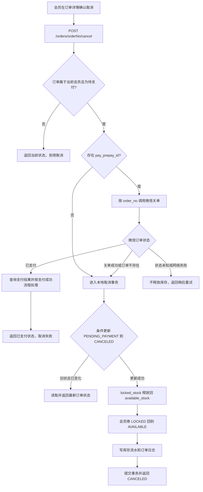
```mermaid
flowchart TD
    Click[会员在订单详情确认取消] --> API[POST /orders/orderNo/cancel]
    API --> Ownership{订单属于当前会员且为待支付?}
    Ownership -- 否 --> Reject[返回当前状态，拒绝取消]
    Ownership -- 是 --> Prepay{存在 pay_prepay_id?}
    Prepay -- 否 --> CancelTx[进入本地取消事务]
    Prepay -- 是 --> ClosePay[按 order_no 调用微信关单]
    ClosePay --> PayResult{微信订单状态}
    PayResult -- 已支付 --> HandlePaid[查询支付结果并按支付成功流程处理]
    HandlePaid --> PaidResult[返回已支付状态，取消失败]
    PayResult -- 关单成功或订单不存在 --> CancelTx
    PayResult -- 状态未知或网络失败 --> Retry[不释放库存，返回稍后重试]

    CancelTx --> StatusUpdate{条件更新 PENDING_PAYMENT 到 CANCELED}
    StatusUpdate -- 旧状态已变化 --> Reload[读取并返回最新订单状态]
    StatusUpdate -- 更新成功 --> ReleaseStock[locked_stock 释放回 available_stock]
    ReleaseStock --> ReleaseCoupon[会员券 LOCKED 回到 AVAILABLE]
    ReleaseCoupon --> Logs[写库存流水和订单日志]
    Logs --> Commit[提交事务并返回 CANCELED]
```

如果支付回调抢先把订单改为待发货，本地取消的旧状态条件必须失败，不能释放已售库存。

## 14. 超时关闭订单流程

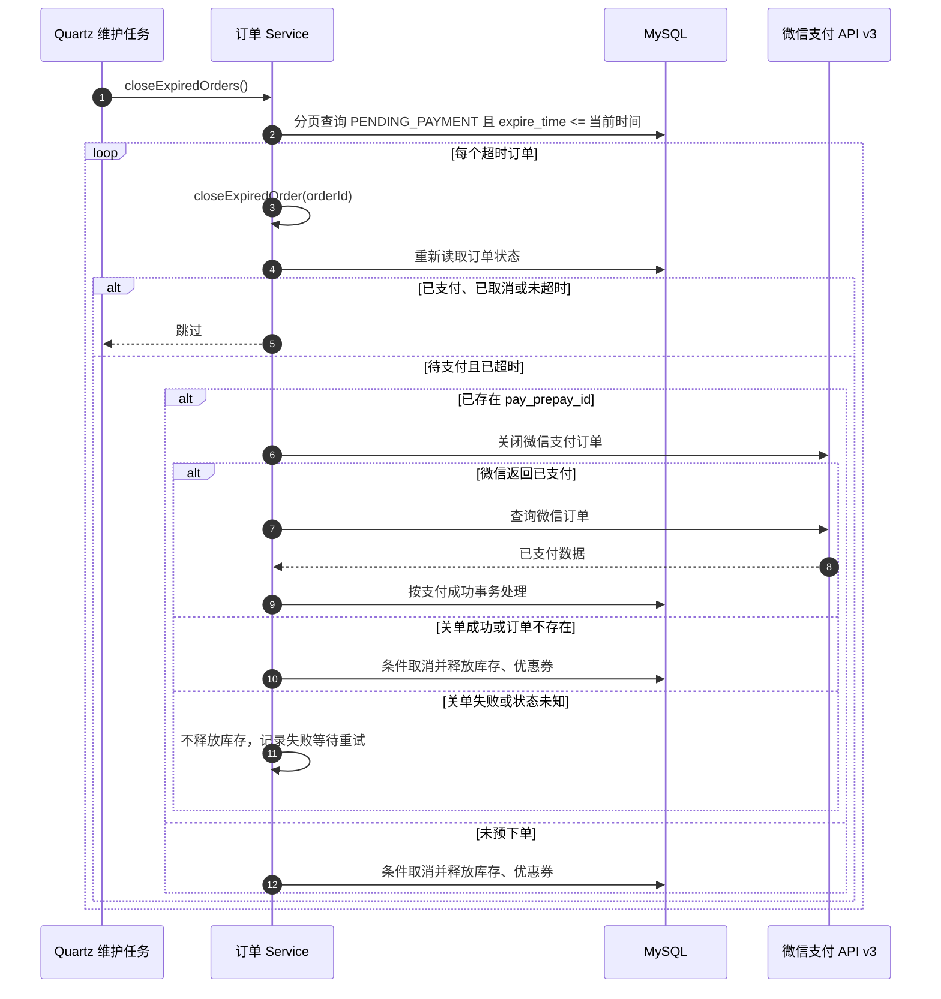
```mermaid
sequenceDiagram
    autonumber
    participant Quartz as Quartz 维护任务
    participant Service as 订单 Service
    participant DB as MySQL
    participant Pay as 微信支付 API v3

    Quartz->>Service: closeExpiredOrders()
    Service->>DB: 分页查询 PENDING_PAYMENT 且 expire_time <= 当前时间
    loop 每个超时订单
        Service->>Service: closeExpiredOrder(orderId)
        Service->>DB: 重新读取订单状态
        alt 已支付、已取消或未超时
            Service-->>Quartz: 跳过
        else 待支付且已超时
            alt 已存在 pay_prepay_id
                Service->>Pay: 关闭微信支付订单
                alt 微信返回已支付
                    Service->>Pay: 查询微信订单
                    Pay-->>Service: 已支付数据
                    Service->>DB: 按支付成功事务处理
                else 关单成功或订单不存在
                    Service->>DB: 条件取消并释放库存、优惠券
                else 关单失败或状态未知
                    Service->>Service: 不释放库存，记录失败等待重试
                end
            else 未预下单
                Service->>DB: 条件取消并释放库存、优惠券
            end
        end
    end
```

任务允许重复运行；单个订单失败不应阻断整批，其余订单继续处理，失败订单记录必要日志后等待下次任务重试。

## 15. 发货与确认收货流程

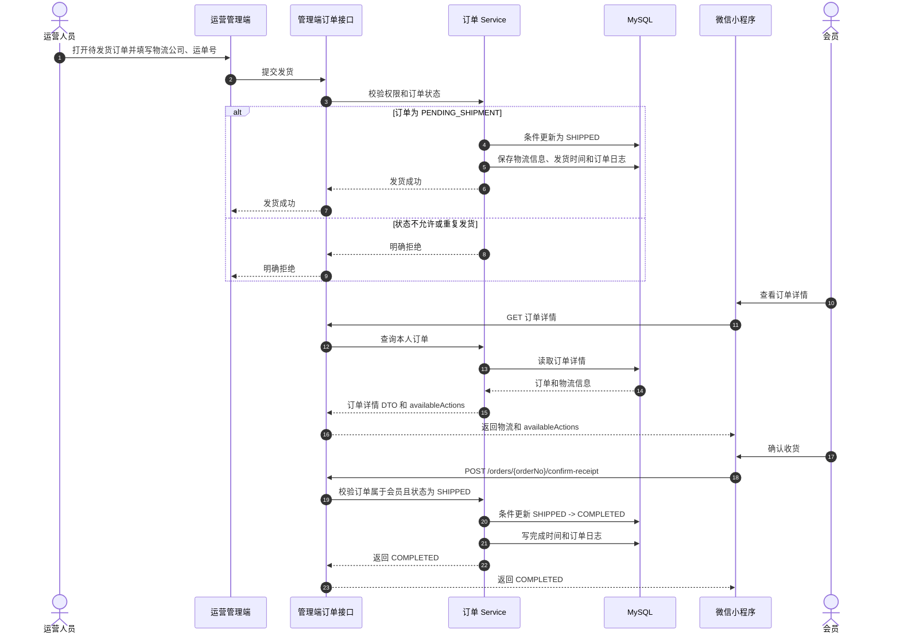
```mermaid
sequenceDiagram
    autonumber
    actor Operator as 运营人员
    participant Admin as 运营管理端
    participant API as 管理端订单接口
    participant Service as 订单 Service
    participant DB as MySQL
    participant App as 微信小程序
    actor User as 会员

    Operator->>Admin: 打开待发货订单并填写物流公司、运单号
    Admin->>API: 提交发货
    API->>Service: 校验权限和订单状态
    alt 订单为 PENDING_SHIPMENT
        Service->>DB: 条件更新为 SHIPPED
        Service->>DB: 保存物流信息、发货时间和订单日志
        Service-->>API: 发货成功
        API-->>Admin: 发货成功
    else 状态不允许或重复发货
        Service-->>API: 明确拒绝
        API-->>Admin: 明确拒绝
    end

    User->>App: 查看订单详情
    App->>API: GET 订单详情
    API->>Service: 查询本人订单
    Service->>DB: 读取订单详情
    DB-->>Service: 订单和物流信息
    Service-->>API: 订单详情 DTO 和 availableActions
    API-->>App: 返回物流和 availableActions
    User->>App: 确认收货
    App->>API: POST /orders/{orderNo}/confirm-receipt
    API->>Service: 校验订单属于会员且状态为 SHIPPED
    Service->>DB: 条件更新 SHIPPED -> COMPLETED
    Service->>DB: 写完成时间和订单日志
    Service-->>API: 返回 COMPLETED
    API-->>App: 返回 COMPLETED
```

首期一单一个包裹，不支持部分发货；物流信息只能在待发货状态首次写入。

## 16. 订单状态机

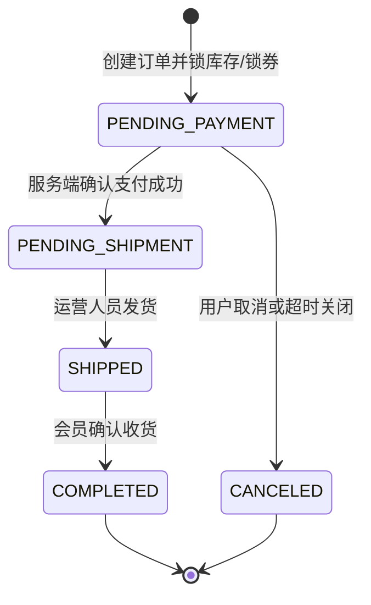
```mermaid
stateDiagram-v2
    [*] --> PENDING_PAYMENT: 创建订单并锁库存/锁券
    PENDING_PAYMENT --> PENDING_SHIPMENT: 服务端确认支付成功
    PENDING_PAYMENT --> CANCELED: 用户取消或超时关闭
    PENDING_SHIPMENT --> SHIPPED: 运营人员发货
    SHIPPED --> COMPLETED: 会员确认收货
    COMPLETED --> [*]
    CANCELED --> [*]
```

允许动作由服务端根据当前状态返回，前端按钮只负责展示，不能决定状态能否迁移。

## 17. SKU 库存变化流程

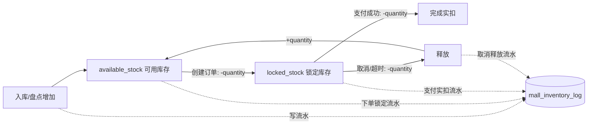
```mermaid
flowchart LR
    Inbound[入库/盘点增加] --> Available[available_stock 可用库存]
    Available -->|创建订单: -quantity| Locked[locked_stock 锁定库存]
    Locked -->|支付成功: -quantity| Sold[完成实扣]
    Locked -->|取消/超时: -quantity| Release[释放]
    Release -->|+quantity| Available

    Inbound -.写流水.-> Log[(mall_inventory_log)]
    Available -.下单锁定流水.-> Log
    Locked -.支付实扣流水.-> Log
    Release -.取消释放流水.-> Log
```

每次库存变化必须在同一事务写变更前后值和业务号；唯一 `(sku_id, biz_type, biz_no)` 防止重复流水。

## 18. 会员券状态流程

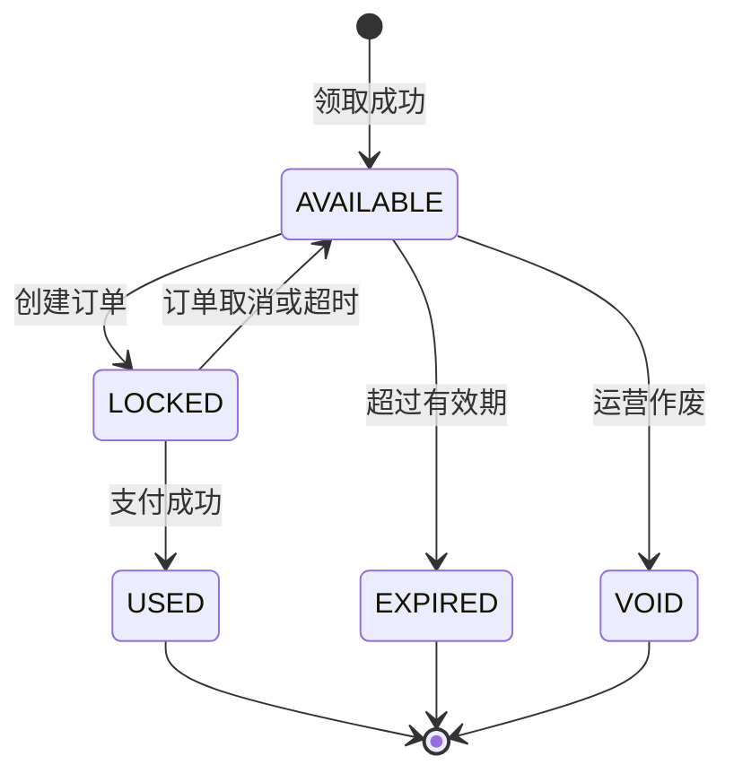
```mermaid
stateDiagram-v2
    [*] --> AVAILABLE: 领取成功
    AVAILABLE --> LOCKED: 创建订单
    LOCKED --> USED: 支付成功
    LOCKED --> AVAILABLE: 订单取消或超时
    AVAILABLE --> EXPIRED: 超过有效期
    AVAILABLE --> VOID: 运营作废
    USED --> [*]
    EXPIRED --> [*]
    VOID --> [*]
```

订单锁券、支付核销和取消解锁必须与订单及库存写入处于同一事务。

## 19. 订单查询与页面刷新流程

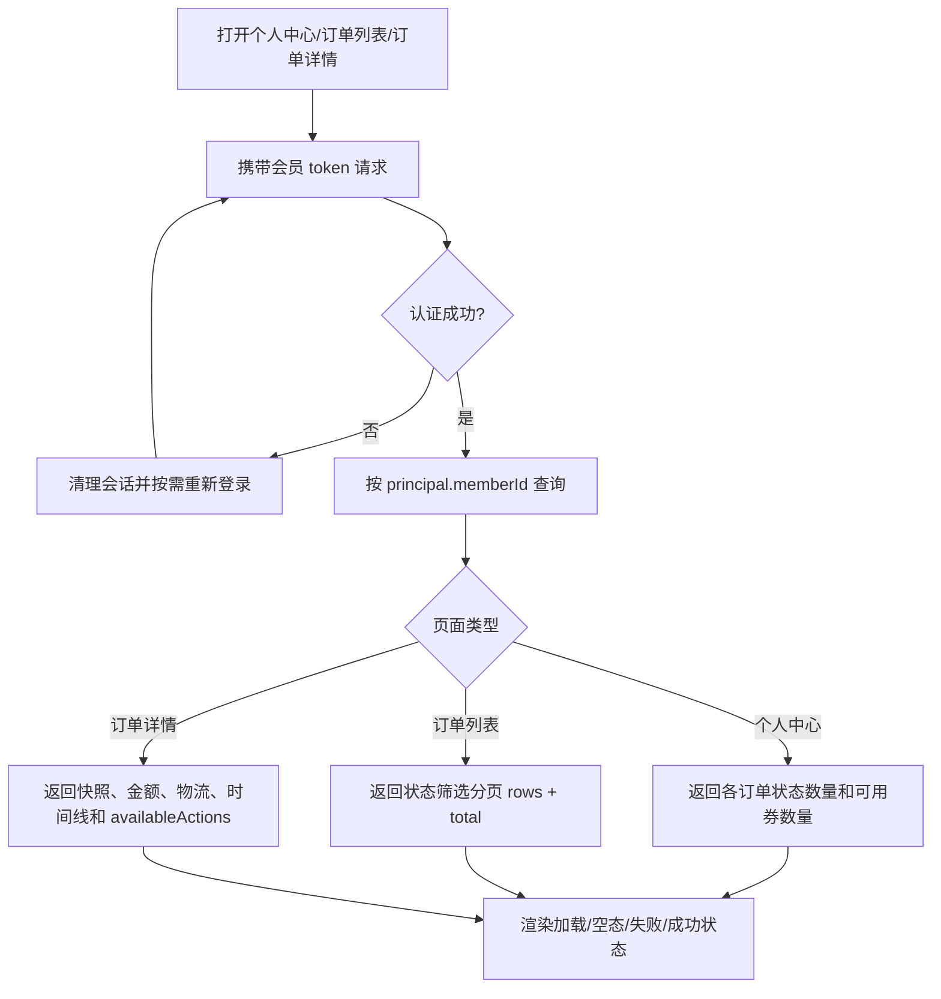
```mermaid
flowchart TD
    Open[打开个人中心/订单列表/订单详情] --> Request[携带会员 token 请求]
    Request --> Auth{认证成功?}
    Auth -- 否 --> Login[清理会话并按需重新登录]
    Login --> Request
    Auth -- 是 --> Query[按 principal.memberId 查询]
    Query --> Page{页面类型}
    Page -- 个人中心 --> Counts[返回各订单状态数量和可用券数量]
    Page -- 订单列表 --> Rows[返回状态筛选分页 rows + total]
    Page -- 订单详情 --> Detail[返回快照、金额、物流、时间线和 availableActions]
    Counts --> Render[渲染加载/空态/失败/成功状态]
    Rows --> Render
    Detail --> Render
```

支付返回小程序后、主动取消后和确认收货后，都重新查询服务端订单，不在前端自行修改最终状态。

## 20. 统一请求失败与重试流程

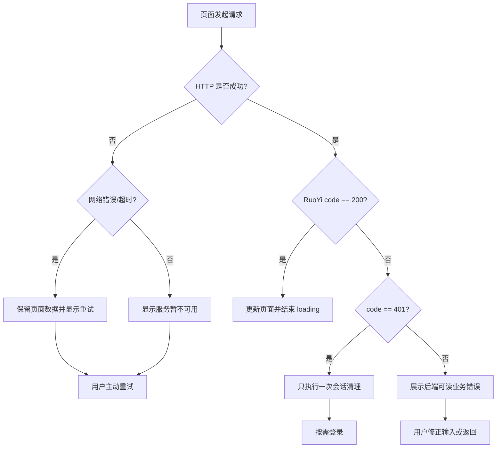
```mermaid
flowchart TD
    Start[页面发起请求] --> Http{HTTP 是否成功?}
    Http -- 否 --> Network{网络错误/超时?}
    Network -- 是 --> RetryUI[保留页面数据并显示重试]
    Network -- 否 --> ServerError[显示服务暂不可用]

    Http -- 是 --> Code{RuoYi code == 200?}
    Code -- 是 --> Success[更新页面并结束 loading]
    Code -- 否 --> Unauthorized{code == 401?}
    Unauthorized -- 是 --> Clear[只执行一次会话清理]
    Clear --> LoginGuide[按需登录]
    Unauthorized -- 否 --> BizError[展示后端可读业务错误]

    RetryUI --> UserRetry[用户主动重试]
    ServerError --> UserRetry
    BizError --> FixInput[用户修正输入或返回]
```

写请求默认不自动重放。只有 GET 等幂等查询可以在重新登录后自动执行一次；订单创建即使重试也必须复用原 `clientRequestNo`。

## 21. 全链路验收顺序

```mermaid
flowchart LR
    A[后台建立分类/商品/SKU] --> B[库存入库并上架]
    B --> C[小程序游客浏览和加购]
    C --> D[微信登录]
    D --> E[地址和优惠券]
    E --> F[订单预结算]
    F --> G[幂等创建待支付订单]
    G --> H[微信支付与异步通知]
    H --> I[后台发货]
    I --> J[会员确认收货]
    G --> K[取消或超时关闭]
```

按这条链路逐段验收，前一段没有真实数据和可重复检查时不进入下一段。没有微信商户配置时验收到 `PENDING_PAYMENT` 为止，禁止使用生产可达的模拟支付接口。
