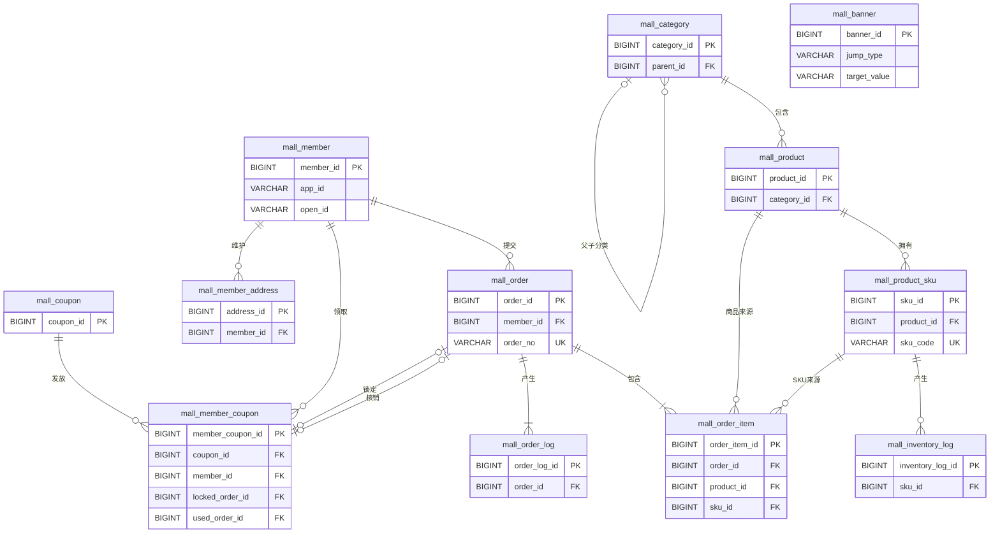

# 商城数据库关系表设计计划

> 日期：2026-07-27
>
> 状态：待评审，当前只设计关系，不创建或执行 SQL
>
> 关联计划：[商城运营后台落地计划](./2026-07-24-商城运营后台落地计划.md)、[农产品小程序前后端打通计划](./2026-07-27-农产品小程序前后端打通计划.md)

## 1. 目标

在现有 12 张商城核心表范围内，明确主键、外键、唯一键、关系基数、删除规则、交易快照和事务边界，为后续生成 `sql/update` 建表脚本提供唯一依据。

本计划坚持最小设计：当前是单店铺、自营农产品商城，不增加购物车、支付流水、退款、售后、运费模板、多商户和仓库表。等真实业务入口出现后，再通过增量 SQL 扩展。

## 2. 非目标

- 本阶段不连接数据库。
- 本阶段不创建、修改或执行任何 SQL。
- 不把 RuoYi 后台账号 `sys_user` 与小程序消费者 `mall_member` 合并。
- 不为 JSON 规格、图片和农产品参数额外拆表。
- 不以外键代替 Service 层的状态机、归属、金额和库存校验。

## 3. 数据表边界

| 领域 | 表名 | 主键 | 核心职责 | 生命周期 |
| --- | --- | --- | --- | --- |
| 商品 | `mall_category` | `category_id` | 两级商品分类 | 逻辑删除 |
| 商品 | `mall_product` | `product_id` | 农产品 SPU、图文和参数 | 逻辑删除 |
| 商品 | `mall_product_sku` | `sku_id` | 规格、价格和当前库存 | 逻辑删除 |
| 库存 | `mall_inventory_log` | `inventory_log_id` | 可售/锁定库存变动流水 | 只追加 |
| 会员 | `mall_member` | `member_id` | 小程序消费者身份 | 禁用，不物理删除 |
| 会员 | `mall_member_address` | `address_id` | 消费者收货地址 | 逻辑删除 |
| 订单 | `mall_order` | `order_id` | 金额、状态、支付、物流和收货快照 | 永不物理删除 |
| 订单 | `mall_order_item` | `order_item_id` | 商品、SKU、规格和价格快照 | 永不物理删除 |
| 订单 | `mall_order_log` | `order_log_id` | 订单状态变迁和操作审计 | 只追加 |
| 内容 | `mall_banner` | `banner_id` | 小程序轮播内容 | 逻辑删除 |
| 营销 | `mall_coupon` | `coupon_id` | 全场满减券模板 | 停用优先 |
| 营销 | `mall_member_coupon` | `member_coupon_id` | 领券、锁券和核销凭证 | 永不物理删除 |

## 4. 计划关系图

`mall_banner` 故意不连接其他表：`target_value` 会根据 `jump_type` 表示商品、分类、小程序路径或空值，属于多态目标，不能绑定单一外键。

## 5. 物理外键计划

统一策略：所有外键使用 `ON UPDATE RESTRICT ON DELETE RESTRICT`。商城业务以逻辑删除和状态停用为主，禁止级联删除交易数据。

| # | 子表字段 | 父表字段 | 基数 | 可空 | 业务要求 |
| --- | --- | --- | --- | --- | --- |
| 1 | `mall_category.parent_id` | `mall_category.category_id` | 0..1 : N | 是 | 只允许两级，不得指向自己 |
| 2 | `mall_product.category_id` | `mall_category.category_id` | 1 : N | 否 | 商品只能选择启用的二级分类 |
| 3 | `mall_product_sku.product_id` | `mall_product.product_id` | 1 : N | 否 | 草稿可暂时无 SKU，上架前至少一个可售 SKU |
| 4 | `mall_inventory_log.sku_id` | `mall_product_sku.sku_id` | 1 : N | 否 | 流水与 SKU 库存更新同事务写入 |
| 5 | `mall_member_address.member_id` | `mall_member.member_id` | 1 : N | 否 | 地址读写必须校验当前会员归属 |
| 6 | `mall_order.member_id` | `mall_member.member_id` | 1 : N | 否 | 会员禁用不影响历史订单 |
| 7 | `mall_order_item.order_id` | `mall_order.order_id` | 1 : N | 否 | 每张订单至少一条明细，由创单事务保证 |
| 8 | `mall_order_item.product_id` | `mall_product.product_id` | 1 : N | 否 | ID 用于追溯，页面展示使用订单快照 |
| 9 | `mall_order_item.sku_id` | `mall_product_sku.sku_id` | 1 : N | 否 | SKU 改名改价不能改写订单明细 |
| 10 | `mall_order_log.order_id` | `mall_order.order_id` | 1 : N | 否 | 创单时必须写入初始日志 |
| 11 | `mall_member_coupon.coupon_id` | `mall_coupon.coupon_id` | 1 : N | 否 | 会员券同时保留券规则快照 |
| 12 | `mall_member_coupon.member_id` | `mall_member.member_id` | 1 : N | 否 | 锁券、核销必须校验会员归属 |
| 13 | `mall_member_coupon.locked_order_id` | `mall_order.order_id` | 0..1 : 0..1 | 是 | `LOCKED` 时关联待支付订单，并加唯一索引 |
| 14 | `mall_member_coupon.used_order_id` | `mall_order.order_id` | 0..1 : 0..1 | 是 | `USED` 时关联已核销订单，并加唯一索引 |

`mall_order` 不反向保存 `member_coupon_id`。会员券通过 `locked_order_id` / `used_order_id` 指向订单，订单保留券规则和优惠金额快照。这样能完成追溯，也避免订单与会员券形成循环外键。

MySQL 唯一索引允许存在多行 `NULL`，因此两个订单关联列可以在未锁定、未使用时为空，同时限制一张订单最多使用一张券。

## 6. 计划保留的弱关系

| 字段或场景 | 关系目标 | 不建外键的原因 | 校验方式 |
| --- | --- | --- | --- |
| `mall_banner.target_value` | 商品、分类或页面 | 多态目标 | 按 `jump_type` 在 Service 中校验 |
| `mall_inventory_log.biz_no` | 订单号、盘点号或调整号 | 多种业务来源 | `biz_type + biz_no` 解释来源 |
| 订单收货信息 | 下单时选择的地址 | 地址可被修改、删除 | 校验 `addressId` 后复制地址快照 |
| `mall_order_log.operator_id` | `sys_user`、会员或系统任务 | 操作者类型不唯一，日志必须长期保留 | `operator_type + operator_id + description` 留痕 |
| `mall_order.channel_trade_no` | 微信支付交易 | 外部系统数据 | 回调验签并使用唯一索引防重 |
| 商品规格、图片、参数 JSON | 无独立子表 | 当前只整体读写，拆表没有查询收益 | 后端验证 JSON 结构 |

## 7. 唯一键计划

| 表 | 唯一键 | 目的 |
| --- | --- | --- |
| `mall_product_sku` | `sku_code` | SKU 业务编码不重复 |
| `mall_inventory_log` | `(sku_id, biz_type, biz_no)` | 同一业务不能重复扣减或释放库存 |
| `mall_member` | `(app_id, open_id)` | 同一小程序用户只建档一次 |
| `mall_order` | `order_no` | 订单号不重复 |
| `mall_order` | `(member_id, client_request_no)` | 小程序重复点击不能重复创单 |
| `mall_order` | `(pay_channel, channel_trade_no)` | 同一支付交易不能绑定多张订单 |
| `mall_member_coupon` | `coupon_no` | 会员券凭证号不重复 |
| `mall_member_coupon` | `locked_order_id` | 一张待支付订单最多锁定一张券 |
| `mall_member_coupon` | `used_order_id` | 一张已支付订单最多核销一张券 |

## 8. 普通索引计划

| 表 | 索引列 | 主要查询 |
| --- | --- | --- |
| `mall_category` | `(parent_id, status, sort_num)` | 子分类和首页分类 |
| `mall_product` | `(category_id, status, del_flag)` | 分类商品列表 |
| `mall_product_sku` | `(product_id, status, del_flag)` | 商品可售 SKU |
| `mall_inventory_log` | `(sku_id, create_time)` | SKU 库存时间线 |
| `mall_member_address` | `(member_id, is_default, del_flag)` | 我的地址和默认地址 |
| `mall_order` | `(member_id, order_status, create_time)` | 小程序我的订单 |
| `mall_order` | `(order_status, create_time)` | 运营待办和超时关单扫描 |
| `mall_order_item` | `(order_id)` | 订单明细 |
| `mall_order_log` | `(order_id, create_time)` | 订单操作时间线 |
| `mall_banner` | `(status, sort_num, begin_time, end_time)` | 当前可见轮播 |
| `mall_coupon` | `(status, receive_begin_time, receive_end_time)` | 当前可领取优惠券 |
| `mall_member_coupon` | `(member_id, status, valid_end_time)` | 我的可用券和过期扫描 |

所有外键列必须可命中索引；已有联合索引覆盖最左列时，不再增加重复的单列索引。

## 9. 交易快照计划

| 内容 | 关系 ID | 快照位置 | 历史读取规则 |
| --- | --- | --- | --- |
| 下单会员 | `mall_order.member_id` | 无需复制昵称头像 | 订单归属始终按会员 ID 校验 |
| 收货地址 | `addressId` 只在下单时校验 | `mall_order` 收件人、电话、地区和详细地址 | 永远显示订单快照 |
| 商品和 SKU | `mall_order_item.product_id` / `sku_id` | 商品名、SKU 名、规格、图片和单价 | 显示快照，ID 只用于追溯和统计 |
| 优惠券 | `locked_order_id` / `used_order_id` | `mall_order` 的券名、门槛和优惠金额 | 显示订单快照，核销追溯会员券 |

主数据修改后不反向更新历史订单。当前商品价格、地址内容或券规则与订单快照不一致时，交易事实以订单快照为准。

## 10. 事务边界计划

| 流程 | 同一数据库事务涉及的表 | 原子结果 |
| --- | --- | --- |
| 领券 | `mall_coupon`、`mall_member_coupon` | 扣减券库存并创建会员券 |
| 创建订单 | `mall_product_sku`、`mall_order`、`mall_order_item`、`mall_inventory_log`、`mall_order_log`，可选 `mall_member_coupon` | 锁库存、写快照、记流水，选券时锁券 |
| 支付成功 | `mall_order`、`mall_product_sku`、`mall_inventory_log`、`mall_order_log`，可选 `mall_member_coupon` | 推进状态、确认库存消耗、核销券 |
| 取消或超时关单 | `mall_order`、`mall_product_sku`、`mall_inventory_log`、`mall_order_log`，可选 `mall_member_coupon` | 取消订单、释放库存、解锁券 |
| 发货 | `mall_order`、`mall_order_log` | 保存物流快照并推进状态 |
| 确认收货 | `mall_order`、`mall_order_log` | 完成状态和完成时间一致 |
| 人工调库存 | `mall_product_sku`、`mall_inventory_log` | 库存结果与调整原因一起留痕 |

微信支付无法加入本地数据库事务。支付回调依赖签名校验、`channel_trade_no` 唯一约束、订单状态条件更新和重复回调幂等处理，不增加独立支付表。

## 11. Service 层补充约束

以下规则不能只靠表关系完成：

1. 分类最多两级，不能指向自己或形成循环。
2. 商品上架前至少有一个启用且有可售库存的 SKU。
3. `available_stock`、`locked_stock` 不能小于 0，扣减使用带库存条件的原子更新。
4. 每个会员最多一个默认地址，切换默认地址必须在事务内完成。
5. 每张订单至少一条订单明细。
6. 订单和会员券只能按已定义状态机流转，使用条件 `UPDATE` 和 `version` 乐观锁。
7. 会员券必须属于当前会员、处于可用期且达到订单金额门槛。
8. 优惠金额不能大于商品金额，应付金额不能为负数。
9. 微信支付回调的金额、商户号和 `app_id` 必须与订单一致。

## 12. SQL 建表顺序

后续按依赖顺序生成 SQL，不需要补建循环外键：

1. `mall_category`
2. `mall_product`
3. `mall_product_sku`
4. `mall_member`
5. `mall_member_address`
6. `mall_coupon`
7. `mall_order`
8. `mall_order_item`
9. `mall_order_log`
10. `mall_member_coupon`
11. `mall_inventory_log`
12. `mall_banner`

## 13. 实施步骤

### 阶段一：关系评审

- 确认 12 张表覆盖运营后台和小程序首期页面。
- 确认 14 条物理外键、弱关系和交易快照边界。
- 确认一张订单最多使用一张全场满减券。
- 确认不建设售后、退款、多仓和多商户模型。

### 阶段二：生成 SQL

- 先在 `/home/zst/GitHub_projects/agritech-vue/sql/update/` 新建完整 SQL 文件。
- 文件名使用 `xxxx-xx-xx-描述.sql`，建议为 `2026-07-27-新建商城核心表.sql`。
- SQL 包含表、字段注释、主键、14 条外键、唯一键、普通索引和回滚说明。
- 金额统一使用 `BIGINT` 分，ID 统一使用 `BIGINT UNSIGNED`，时间统一使用 `datetime(3)`。

### 阶段三：人工审核

- 对照本计划逐条检查表数、字段类型、关系、索引和删除策略。
- 检查是否存在重复索引和不必要 JSON 拆表。
- 检查任何交易表上都没有 `ON DELETE CASCADE`。
- 审核完成前不得连接数据库执行。

### 阶段四：执行与验证

- 得到明确执行许可后才运行 `sql/update` 中的脚本。
- 验证 12 张表、14 条外键和全部唯一键。
- 使用最小测试数据验证分类、商品、SKU、会员、创单、锁库、锁券、支付和取消关系。
- 验证删除被引用主数据时数据库拒绝，逻辑删除后业务接口正确过滤。

## 14. SQL 安全条件

1. 每次数据库结构或数据变更，都必须先在 `sql/update/` 生成对应 SQL 文件。
2. 文件命名必须符合 `xxxx-xx-xx-描述.sql`。
3. 不允许在终端临时拼接 DDL 或 DML 后直接执行。
4. SQL 文件未经人工审核和明确授权，不得执行。
5. 执行前记录目标数据库和备份情况，执行后保留验证结果。

## 15. 验收标准

- [ ] 数据表严格为 12 张，没有未被首期业务使用的预留表。
- [ ] 主键和外键类型完全一致，均为 `BIGINT UNSIGNED`。
- [ ] 14 条物理外键均使用 `RESTRICT`，不存在级联删除。
- [ ] 外键列都有可用索引，且没有重复索引。
- [ ] 订单地址、商品、SKU 和优惠券快照齐全。
- [ ] 库存流水和订单日志只追加，无编辑和删除入口。
- [ ] 创单、支付、取消、库存和券核销的事务边界与本计划一致。
- [ ] 非平凡 Service 校验各留下一项最小可运行测试。
- [ ] SQL 先落在 `sql/update/`，审核后才执行。
